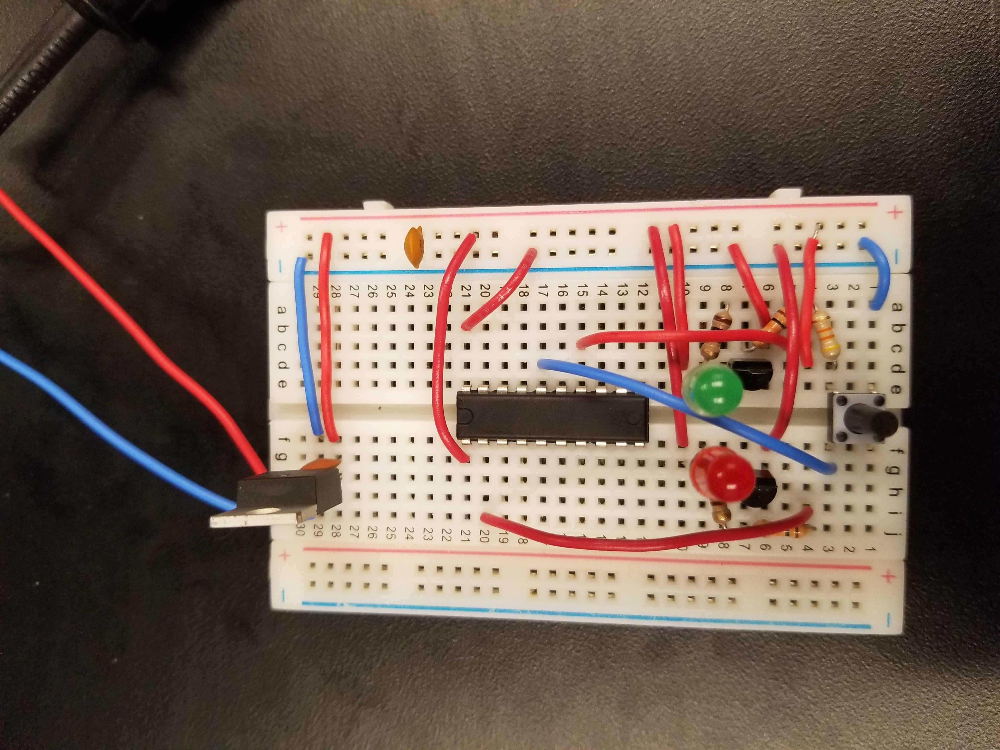

# Button Blink
## Stephen Glass

### Compatibility
* MSP430G2553

### Description
blink.c is code when programmed to the MSP430G2553 allows the processor to blink 2 LEDs while in an offboard application. In this application, the DIP Package MSP430G2553 processor is taken off the Texas Instruments LaunchPad Development Board and put onto a breadboard. When doing this a few essential components are necessary:
* Power regulation
* Reset circuitry
* Convert-o-boxes (optional)

We first need to ensure we are feeding the processor clean regulated processor. The MSP430G2553 can take anywhere from 3.3V - 5.0V as input. In this application, we will use a 3.3V Linear Voltage Regular to feed the processor a clean 3.3V input. We put a bypass capacitor between the power rails to reduce high frequency noise.

The MSP430G2553 reset is active low - so it is essential we have the reset pin on the processor connected to VCC. In this application, we are using a button to create a reset button. When the button is pressed, it grounds the reset connection, thus reseting the processor.

Optionally, two convert-o-boxes are designed using BJT as switches for a load (LED). When a high signal is sent to the base of the transistor, it switches on the BJT in saturation mode and powers an LED connected to the collector. This convert-o-box allows us to make the LED brighter as we can feed more current.

## YouTube Video Demonstration
](https://www.youtube.com/watch?v=vL-gEn5I51Q)